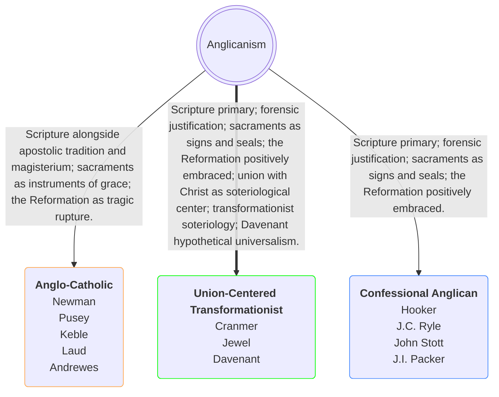
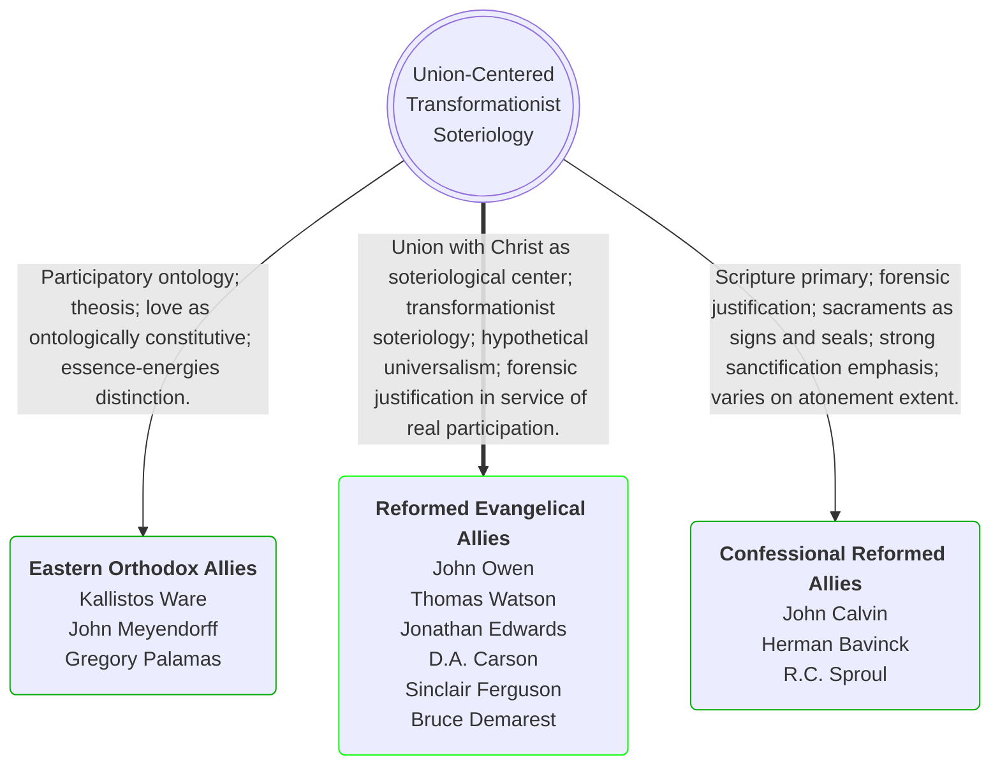

Anglicanism is not a monolith. Within its broad historical tradition exist streams so theologically distinct that they represent fundamentally different answers to the most basic questions of Christian doctrine — authority, salvation, the sacraments, and the meaning of the Reformation itself. Understanding where the Order of Light stands requires distinguishing not just two positions but three: Anglo-Catholicism, standard Confessional Anglicanism, and the Union-Centered Transformationist Anglican tradition — a historically established via media that is neither five-point Calvinist nor Arminian, but occupies a third position with its own impeccable theological pedigree.

<strong>The Order of Light stands explicitly within this third tradition.</strong> Its soteriological heart is union with Christ — the organizing center from which all benefits of salvation flow. It embraces a transformationist soteriology rather than a merely imputationist one, insisting that forensic justification is not the endpoint of salvation but the ground from which genuine Spirit-worked transformation necessarily and freely grows. And it follows John Davenant's hypothetical universalism on the extent of the atonement — affirming that Christ's death was genuinely provisioned for all humanity while remaining efficacious only for the elect through sovereign grace.

This third position stands on centuries of established theological precedent — predating the rigid Calvinist-Arminian binary that has dominated Protestant debate since the seventeenth century and in important respects transcending it. It is not a modern compromise or a softened Calvinism. It affirms sovereign grace and forensic justification while insisting that the atonement was genuinely provisioned for all humanity, that union with Christ is the soteriological center from which all benefits flow, and that salvation necessarily produces real observable transformation in the believer.

This tradition running from the English Reformers through the broader Reformed evangelical stream — including John Davenant, the Puritans, and Jonathan Edwards — represents the dominant soteriological inheritance of historic Protestant orthodoxy, of which Anglican confessionalism was the English institutional expression. The Order of Light does not invent this position — it retrieves and inhabits it. What follows is a comparison of all three streams across every major theological category.

## On Authority

**Anglo-Catholic:** Scripture interpreted through apostolic tradition and the magisterium of the church. Tradition carries independent doctrinal authority alongside Scripture.

**Confessional Anglican:** Scripture is the primary authority, with confessions serving as faithful summaries of scriptural teaching. The Reformation's doctrinal reforms are explicitly embraced, not bracketed.

**Union-Centered Transformationist Anglican:** Fully shares the Confessional Anglican position on Scripture's primacy, standing in direct continuity with Cranmer, Jewel, and the English Reformers who grounded Anglican identity in Scripture alone against Roman appeals to tradition. The confessional standards chosen — particularly the Thirty-Nine Articles, the Declaration of Principles, and the Heidelberg Catechism — are those which most faithfully express the scriptural soteriology of union with Christ that the English Reformers, Davenant, and Edwards all centered their theology upon. Notably the Heidelberg Catechism is of such genuine Protestant breadth that even Jacobus Arminius subscribed to it without reservation — demonstrating its character as common ground for all seriously evangelical Christians rather than a narrowly partisan document.

## On Justification

**Anglo-Catholic:** Justification is typically understood as a process involving infused righteousness — grace communicated through the sacraments gradually transforms the believer. Rome's Council of Trent defined this position explicitly against Protestant forensic justification.

**Confessional Anglican:** Justification is forensic — Christ's righteousness imputed to the believer as a legal declaration. This is the non-negotiable Protestant distinctive recovered by the Reformation and enshrined in the Thirty-Nine Articles.

**Union-Centered Transformationist Anglican:** Fully and unambiguously affirms forensic justification as the necessary legal ground of salvation — Christ's righteousness credited to the believer by grace through faith alone. However this tradition insists that imputation is not the soteriological endpoint but is in service of something deeper: genuine union with Christ from which real transformation necessarily flows. Justification and sanctification are distinguished but never separated — both are simultaneous gifts flowing from union with Christ himself. This tradition is therefore transformationist rather than merely imputationist — not because it weakens justification but because it recognizes that God's saving work in the believer does not end with the forensic declaration — it overflows into genuine Spirit-worked transformation as its necessary and free consequence. The Christian is not merely declared righteous and left unchanged — through union with Christ, the indwelling Spirit necessarily and freely produces genuine righteousness in the believer as the fruit of a justification already complete and irrevocable. Transformation is the evidence of grace received, never the ground of standing before God.

## On the Sacraments

**Anglo-Catholic:** Sacraments are instruments that actually convey grace — baptismal regeneration, eucharistic presence, sacerdotal priesthood. The priest mediates grace  through sacramental acts.

**Confessional Anglican:** Sacraments are signs and seals rather than regenerating instruments. The Declaration of Principles explicitly rejects the error that regeneration is inseparably connected with baptism.

**Union-Centered Transformationist Anglican:** Fully affirms the Confessional Anglican sacramental position, standing in the tradition of Cranmer's Reformed eucharistic theology and the English Reformers' deliberate rejection of Roman sacramentalism. The positive theological ground for this rejection is the doctrine of union with Christ — regeneration is the sovereign Spirit-worked consequence of genuine union with Christ, not a mechanical effect of a liturgical act. Sacraments are signs and seals of a grace that the Spirit alone works through the living Word and genuine faith — a position the English Reformers enshrined in the formularies and that Davenant and the confessional Reformed Anglican stream consistently maintained against sacramentalist readings of those same formularies — one  that grounds baptism and the Lord's Supper in the deeper reality of union with Christ rather than in the sacramental act itself.

## On Union with Christ

**Anglo-Catholic:** Participatory language is used but tends toward ontological absorption — theosis in a quasi-Catholic direction, typically mediated through the Eucharist as the primary locus of union with Christ.

**Confessional Anglican:** Union with Christ is affirmed as a genuine soteriological reality — the Westminster Confession and Heidelberg Catechism both speak of it — but it functions variably across the tradition. In some expressions it is foregrounded; in others it recedes behind forensic categories.

**Union-Centered Transformationist Anglican:** Union with Christ is the explicit soteriological center — not one benefit among many but the organizing principle from which all other benefits flow. This is not a modern innovation. The English Reformers grounded salvation in genuine spiritual union with Christ through the Spirit and by faith. Cranmer's eucharistic theology turned precisely on spiritual union with Christ as the reality the sacrament signifies. Jonathan Edwards developed this further with his language of the new spiritual sense and religious affections as the intrinsic form that union takes in the regenerate soul — love, righteousness, and transformation are not merely expected outcomes of union but its lived expression. This tradition treats observable love and genuine righteousness as intrinsic expressions of union rather than merely external evidences of it — which is precisely what 1 John's framework demands and what distinguishes transformationist soteriology from both Anglo-Catholic sacramentalism and bare forensic imputationism.

## On the Reformation

**Anglo-Catholic:** The Reformation is at best a tragic rupture to be overcome through ecumenical retrieval, at worst a heretical deviation from apostolic continuity.

**Confessional Anglican:** The Reformation's doctrinal reforms are explicitly and positively embraced as recoveries of biblical truth obscured by medieval accretion. The tradition stands in direct continuity with Cranmer, Jewel, and the English Reformers.

**Union-Centered Transformationist Anglican:** Fully shares the Confessional Anglican embrace of the Reformation but locates its own position within the specific stream of Reformation theology that treated union with Christ as the Reformation's deepest soteriological recovery rather than its forensic categories alone. The English Reformers, Davenant at the Synod of Dort, and Edwards in New England all represent successive developments of this same  theological tradition — not departures from Reformation orthodoxy but its fullest and most coherent expression. The Reformation recovered not merely imputed righteousness but the participatory reality that imputed righteousness exists to serve.

## On Atonement Extent

**Anglo-Catholic:** Atonement theology tends toward participatory and sacrificial categories — the Mass understood as a re-presentation of the sacrifice of Christ. Penal substitutionary atonement is frequently downplayed or rejected as an overly juridical framework.

**Confessional Anglican:** Penal substitutionary atonement is firmly affirmed. Atonement extent varies across the tradition — some affirm definite atonement while others maintain latitude on the question within the bounds of the Thirty-Nine Articles, which deliberately leave room for both readings.

**Union-Centered Transformationist Anglican:** This tradition's position on atonement extent is one of its most distinctive and historically significant contributions. It follows the hypothetical universalism articulated by John Davenant — England's delegate at the Synod of Dort in 1618–19 — who argued that Christ's death was genuinely sufficient and intentionally provisioned for all humanity, but efficacious only for the elect through sovereign grace. This is emphatically not Arminianism. Sovereign election remains fully intact. Efficacious grace remains irresistible. What changes is that God's redemptive intent toward all humanity is genuine rather than merely hypothetical — the gospel offer to every person is a sincere expression of a real provision, not a formal gesture over an empty table. Davenant's position was considered within the bounds of Reformed orthodoxy at the defining moment of Protestant confessionalism, demonstrating that this is not a modern accommodation but a historic option with impeccable theological credentials. It occupies the principled middle ground between five-point definite atonement and Arminian universal salvation — affirming both sovereign grace and genuine universal provision without collapsing either into the other.

## On Sanctification

**Anglo-Catholic:** Sanctification is typically sacramentally mediated and understood in terms of gradual infusion of grace through the church's liturgical and penitential system.

**Confessional Anglican:** Sanctification is the Spirit's work in the believer following justification, producing genuine moral transformation. It is real but distinct from justification — the two are never confused.

**Union-Centered Transformationist Anglican:** Sanctification is the necessary and observable fruit of union with Christ — not merely an expected outcome but an intrinsic expression of what it means to be genuinely united to him. This tradition, following 1 John's framework as the English Reformers, the Puritans, and Edwards all read it, holds that regeneration produces a real directional change in life, that righteousness is genuinely practiced rather than merely credited, and that love for the brethren is an essential non-optional mark of the regenerate. John Owen, Thomas Watson, Jonathan Edwards, and the broader Puritan tradition all represent this transformationist soteriology — salvation changes what you actually are and do, not only your legal standing before God. This is not a new position. It is the historic mainstream of evangelical Anglican sanctification theology, and it stands equally against antinomianism on one side and perfectionism on the other — insisting on real transformation without claiming sinless perfection.

## The Simplest Summary

|                       | Anglo-Catholic           | Confessional Anglican        | Union-Centered Transformationist Anglican                                                        |
| --------------------- | ------------------------ | ---------------------------- | ------------------------------------------------------------------------------------------------ |
| **Authority**         | Scripture + Tradition    | Scripture primary            | Scripture primary; historic evangelical Anglican confessional standards                          |
| **Justification**     | Infused process          | Forensic imputation          | Forensic, in service of union with Christ                                                        |
| **Sacraments**        | Regenerating instruments | Signs and seals              | Signs and seals; regeneration is Spirit-worked through union                                     |
| **Union with Christ** | Eucharistically mediated | Affirmed variably            | Explicit soteriological center; organizing principle of all salvation                            |
| **Reformation**       | Tragic rupture           | Positively embraced          | Positively embraced; union with Christ as its deepest recovery                                   |
| **Atonement Extent**  | Mass as re-presentation  | Varies                       | Davenant hypothetical universalism; genuine universal provision, efficacious for the elect       |
| **Sanctification**    | Sacramentally infused    | Spirit-worked transformation | Intrinsic and observable fruit of union; transformationist, neither antinomian nor perfectionist |

## Conclusion

Anglo-Catholicism is essentially Roman Catholicism that retained English liturgy and rejected papal supremacy while preserving sacramental theology, infused grace, and tradition as co-equal authority alongside Scripture. The Reformation for Anglo-Catholics is at best an embarrassment to be managed.

Standard Confessional Anglicanism is genuinely and unapologetically Protestant — forensic justification, Scripture's primacy, and the Reformation's doctrinal reforms positively embraced — expressed through Anglican liturgical forms rather than Presbyterian or Baptist ones.

The Union-Centered Transformationist Anglican tradition stands within Confessional Anglicanism but with a specific and historically established center that transcends the familiar Calvinist-Arminian binary. It affirms sovereign grace without narrowing the atonement's provision. It affirms genuine universal gospel offer without collapsing into synergism. It affirms forensic justification without treating imputation as the soteriological endpoint. And it insists that union with Christ — the living, Spirit-worked bond between the believer and the risen Lord — is the heart from which forensic justification, transformationist sanctification, and genuine gospel proclamation to all humanity flow as an integrated whole.

This tradition predates the Order of Light by centuries. The English Reformers articulated it in the sixteenth century. Davenant defended it at Dort in the seventeenth. Edwards developed it in the eighteenth. The Puritan tradition embodied it across three centuries of evangelical Anglican and Protestant history.

The Order of Light does not invent this tradition. It retrieves it, inhabits it, and commends it — convinced that it holds the full biblical picture of salvation together with greater fidelity and coherence than any alternative, and that recovering it in the present moment is worth the effort of a brotherhood committed to that end.

<!--  

 

References

<ul class="references">

<li><em>ESV Study Bible</em> (ESV Text Edition: 2016). (2008). Crossway.</li>
<li><em>NET Bible: Full Notes Edition</em>. (2019). Biblical Studies Press, L.L.C.</li>
<li><em>New Living Translation</em>. (2015). Tyndale House Publishers.</li> -->

 

 

Ordo Luminis Fraternitatis Aeternae

