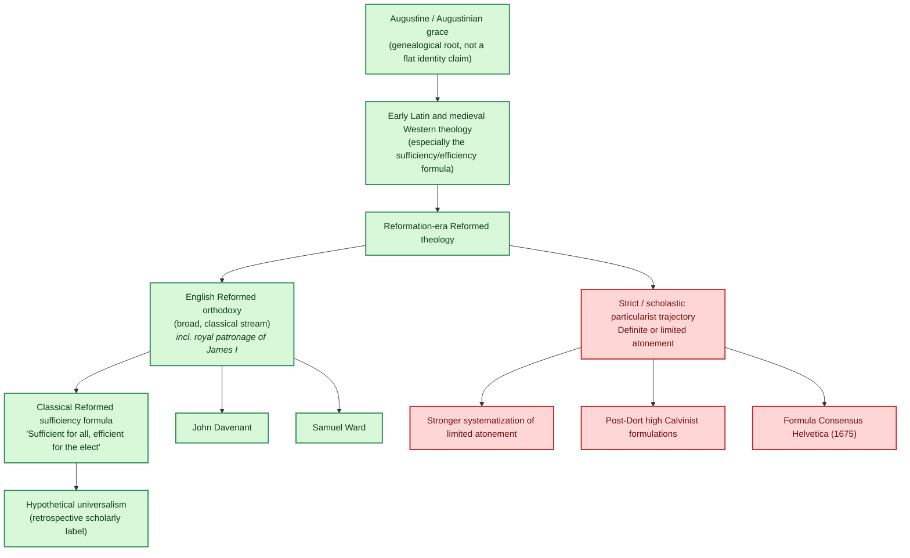

The debate over the extent of Christ's atonement is often framed as a contest between Calvinism and its critics, as though the Reformed tradition spoke with one voice and any softening of that voice necessarily marked a departure from orthodoxy. This article challenges that framing. The position sometimes labeled hypothetical universalism by later scholars is not a concession to Arminianism, a weakening of Reformed soteriology, or a theological novelty. Historically speaking, it belongs to the older and broader stream of the classical Reformed tradition itself.

The chart accompanying this article traces that genealogy. Beginning with the Augustinian inheritance that shaped all Western theology, it follows the line through Reformation-era Reformed orthodoxy into the English Reformed tradition as it took shape in figures like John Davenant and Samuel Ward, delegates to the Synod of Dort who defended a robust, confessionally Reformed soteriology while retaining the ancient sufficiency formula: sufficient for all, efficient for the elect. What later scholars have called hypothetical universalism is not these men's own label for their position. It is a retrospective description applied from outside, and it should be understood as such.

The chart also traces a second line: the later and narrower systematization of strict limited atonement. This stream is not presented here as heretical or outside the Reformed family. It is presented as what it historically is: a development, a tightening, a position that requires its own justification rather than one that can simply assume the mantle of Reformed orthodoxy by default.

The goal of this article is not to relitigate Dort. It is to recover the stability and coherence of the broader classical Reformed position, and to show that the green branch does not need to apologize for existing.

## King James I: Royal Patron of the Broad Reformed Stream

Chronologically, King James I (1566–1625) sits precisely at <strong>English Reformed orthodoxy (broad, classical stream)</strong> and is the royal authority directly behind <strong>Davenant</strong> and <strong>Ward</strong>. James personally granted Davenant and Ward a two-hour royal audience at Royston before they departed for Dort, and his delegation received their royal mandate at Newmarket in October 1618. He is not a theologian on the chart in his own right, but he is the patron and commissioner of the two figures who are named on it.

Theologically, James lands squarely in <strong>English Reformed orthodoxy</strong>, with a meaningful lean toward <strong>the classical sufficiency formula</strong> ("sufficient for all, efficient for the elect"). Several things nail this down:

- King James I opposed Arminianism before, during, and after the Synod of Dort, and under his reign opposition to Arminianism became official policy, with anti-Calvinist views subject to effective censorship.
- At the same time, a reaction from the Calvinist discipline of his youth had not entirely eliminated his sympathy for Calvinist doctrine, and his contribution to 1618–19 was to support the Counter-Remonstrant side theologically at Dort.
- James promoted the importance of the Synod of Dort by sending a learned delegation and approved of its conclusions, though he issued instructions afterward suggesting moderation and restrictions on preaching about the specific theological points involved, wishing the Synod's conclusions to close down the debate rather than inflame it further.
- Critically, in 1612 James wrote a tract against the unorthodox Dutch theologian Conrad Vorstius, a follower of Arminius — an active personal intervention against Arminian theology, not just a passive policy stance.
- His instructions to his Dort delegation were to act as mediators, emphasizing peace and Anglican moderation — which is precisely the spirit of <strong>the classical sufficiency formula</strong> rather than the <strong>strict particularist trajectory</strong>'s strict particularism. The delegates were urged to keep to Scripture and Anglican doctrine, avoid controversial theology, and use moderation in everything, and the delegation was faithful to these instructions in every detail.

Where he does NOT belong: James clearly does not belong on the <strong>strict particularist / post-Dort high Calvinist</strong> branch. He was not a systematician pushing limited atonement as a hard doctrinal fence. And he does not belong on any Arminian branch — he actively suppressed it.

<strong>Summary placement:</strong> James I belongs at <strong>English Reformed orthodoxy (broad, classical stream)</strong>, as both a chronological anchor (reigning 1603–1625, spanning the KJV in 1611 and Dort in 1618–19) and a theological one — he is the royal embodiment of the broad English Reformed orthodoxy that commissioned the KJV translators, sponsored Davenant and Ward at Dort, and deliberately steered the Church of England away from both Arminian permissiveness and high Calvinist rigorism.

<!--  

 

References

<ul class="references">

<li>Chandra, K., Kleiman-Weiner, M., Ragan-Kelley, J., & Tenenbaum, J. B. (2026). Sycophantic chatbots cause delusional spiraling, even in ideal Bayesians (arXiv:2602.19141). <em>arXiv</em>. https://doi.org/10.48550/arXiv.2602.19141</li>
<li><em>ESV Study Bible</em> (ESV Text Edition: 2016). (2008). Crossway.</li>
<li><em>New Living Translation</em>. (2015). Tyndale House Publishers.</li>

</ul> -->

 

 

Ordo Luminis Fraternitatis Aeternae

