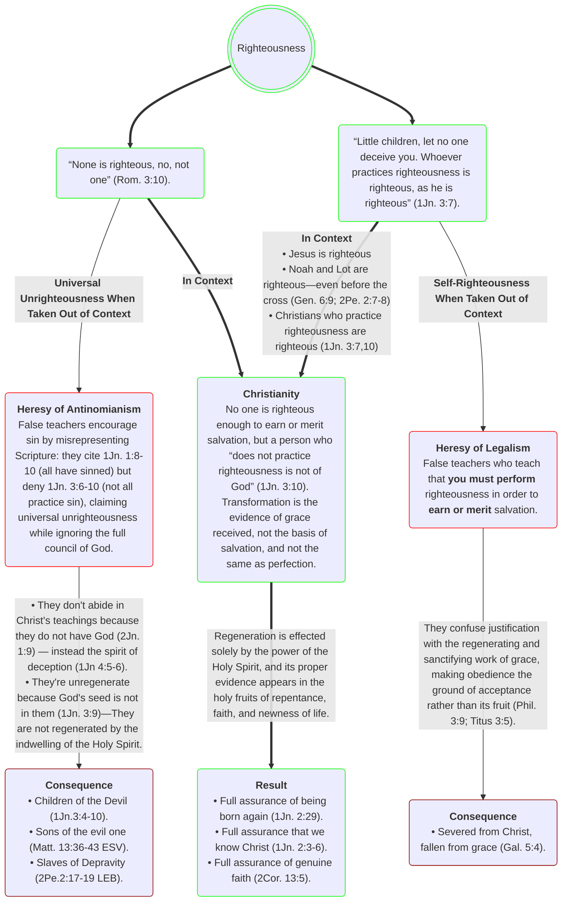

The Bible affirms not only the existence of righteous people, but also that genuine conversion necessarily involves the Holy Spirit's prior work of regeneration, producing faith and righteousness and breaking the pattern of habitual sin in those who are truly born again. Make no mistake, the unrepentant and unrighteous will not enter the Kingdom of Heaven, no matter how superficial their faith is. Those who practice lifestyles of sin1 will not enter the Kingdom of Heaven,2 not because they fail to do works&mdash;that would be legalism&mdash;but because they're unregenerate.3,4

<small>
1\. Gal. 5:19-21; 1Cor. 6:9-11; Eph. 5:5-6; Luk 9:62;  
2\. John 3:3; 1John 3:9. 
3\. 2Cor. 5:17; Gal. 6:15. 
4\. 1Jn. 3:7-10; 1Jn. 5:18
</small>

<!-- <blockquote>
Little children, <strong style="color:Goldenrod">let no one deceive you. Whoever practices righteousness is righteous, as he is righteous</strong> (ESV Study Bible, 2008, 1 John 3:7).
  <blockquote>
  Dear children, don’t let anyone deceive you about this: When people do what is right, it shows that they are righteous, <strong style="color:Goldenrod">even as Christ is righteous</strong> (New Living Translation, 2015, 1 John 3:7).
  </blockquote>
</blockquote> -->

These warnings are written to people who would be listening to the New Testament epistles as they were read aloud <strong>in New Testament Churches</strong> (cf. 1 Cor. 6:9-11; 2 Cor. 13:5; Heb. 3:12; 1 Jn 2:3-6; 3:6, 9-10; 14). That means this is a warning for believers; it is a warning for you:

<blockquote>
Now the works of the flesh are obvious: sexual immorality, impurity, depravity, idolatry, sorcery, hostilities, strife, jealousy, outbursts of anger, selfish rivalries, dissensions, factions, envying, murder, drunkenness, carousing, and similar things. I am warning you, as I had warned you before: Those who <strong style="font-size:1.2em;color:Goldenrod;">practice</strong> such things <strong style="font-size:1.2em;color:Goldenrod;">will not</strong> inherit the kingdom of God! (NET Bible, 2019, Galatians 5:19-21).
</blockquote>

There is no true born again Christian that practices sin. While everyone has sin (1 Jn 1:8–10), not everyone pursues lifestyles of indulgent sin (1 Jn 3:6–10). Though we may stumble, make mistakes, and—God forbid—backslide, there is no such thing as a born again Christian that "practices" sin (habitually and continually pursuing a lifestyle of sin). The Apostle Paul further warns:

<blockquote>
Do you not know that the unrighteous will not inherit the kingdom of God? Do not be deceived! The sexually immoral, idolaters, adulterers, passive homosexual partners, practicing homosexuals, thieves, the greedy, drunkards, the verbally abusive, and swindlers will not inherit the kingdom of God. Some of you once lived this way. But you were washed, you were sanctified, you were justified in the name of the Lord Jesus Christ and by the Spirit of our God(NET Bible, 2019, 1 Cor. 6:9-11).
</blockquote>

Jesus himself taught that no unregenerate person would enter into the Kingdom of Heaven:

<blockquote>
Jesus replied, “I tell you the truth, unless you are born again [regenerated], you cannot see the Kingdom of God” (New Living Translation, 2015, John 3:3).
</blockquote> 

<blockquote>
Then he said, “I tell you the truth, <strong style="font-weight:bold;color:DarkGoldenrod;">unless you turn from your sins and become like little children, you will never get into the Kingdom of Heaven.</strong> So anyone who becomes as humble as this little child is the greatest in the Kingdom of Heaven. “And anyone who welcomes a little child like this on my behalf is welcoming me. <strong style="font-weight:bold;color:DarkGoldenrod;">But if you cause one of these little ones who trusts in me to fall into sin, it would be better for you to have a large millstone tied around your neck and be drowned in the depths of the sea</strong> (New Living Translation, 2015, Matt. 18:3-6 NLT).
</blockquote>

The Apostle Paul calls on us to examine or test our faith, to see if it is genuine, to see if Jesus is really living in us. If he is, well, then you have a living faith, if not, then you have a dead faith and are disqualified, or fail the test of genuine faith (2 Cor. 13:5 NLT; cf. 2 Peter 1:5-10).

<blockquote>
Examine yourselves to see if your faith is genuine. Test yourselves. Surely you know that Jesus Christ is among you; if not, you have failed the test of genuine faith (New Living Translation, 2019, 2 Cor. 13:5 NLT; cf. 2 Peter 1:5-10)
</blockquote>

 

 

References

<ul class="references">
<!-- <li><em>ESV Study Bible</em> (ESV Text Edition: 2016). (2008). Crossway.</li> -->
<li><em>NET Bible: Full Notes Edition</em>. (2019). Biblical Studies Press, L.L.C.</li>
<li><em>New Living Translation</em>. (2015). Tyndale House Publishers.</li>
</ul>

 

 

Ordo Luminis Fraternitatis Aeternae

