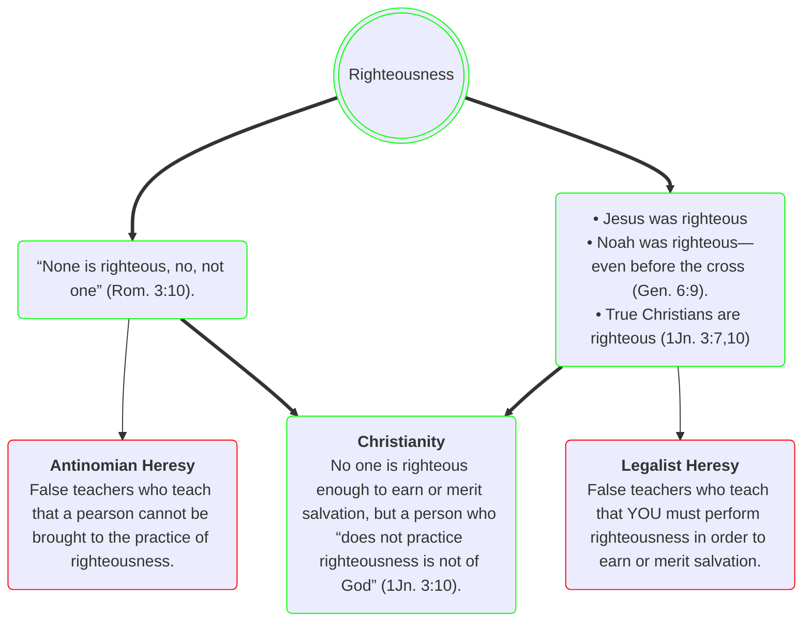

<!-- 
The reason is that God's seed is not in them. They do not have the indwelling of the Holy Spirit.
 -->

<!-- D -- > G(&ldquo;None is righteous, no, not one&rdquo; &lpar;Rom. 3:10&rpar;.):::green -->

<blockquote>
Little children, <strong style="color:Goldenrod">let no one deceive you. Whoever practices righteousness is righteous, as he is righteous</strong> (ESV Study Bible, 2008, 1 John 3:7).
  <blockquote>
  Dear children, don’t let anyone deceive you about this: When people do what is right, it shows that they are righteous, <strong style="color:Goldenrod">even as Christ is righteous</strong> (New Living Translation, 2015, 1 John 3:7).
  </blockquote>
</blockquote>

 

 

References

<ul class="references">
<li><em>ESV Study Bible</em> (ESV Text Edition: 2016). (2008). Crossway.</li>
<li><em>New Living Translation</em>. (2015). Tyndale House Publishers.</li>
</ul>

 

 

Ordo Luminis Fraternitatis Aeternae

